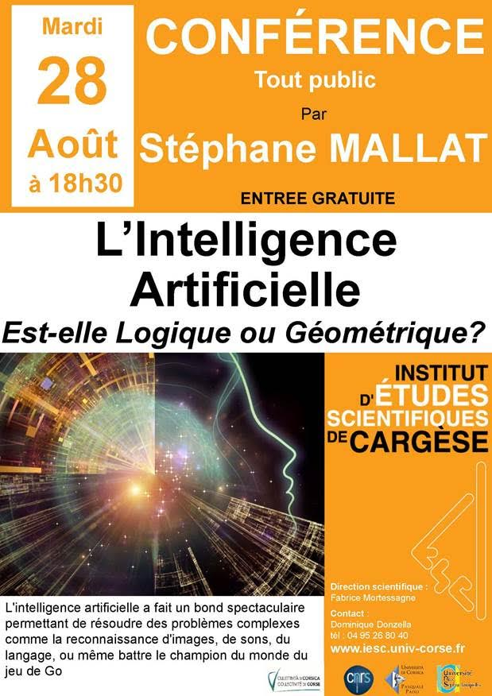

# DAY1: TUESDAY 21

9-12.15: Marc Mezard [Statistical physics of inference](Mezard.pdf)

14-17.15: Andrea Montanari [Lecture notes on two-layer neural networks](Montanari.pdf)

18.30: Welcome drink @ the institute

# DAY2: WEDNESDAY 22

9-12.15: Alexander Tkatchenko: Bringing Atomistic Modeling in
Chemistry and Physics and Machine Learning Together:
[Part 1](Cargese-lecture-2018-1.pdf) and [Part 2](Cargese-lecture-2018-2.pdf).

14-14.45: Guilhem Semerjian   [Phase transitions in inference problems on sparse random graphs](semerjian_cargese.pdf)

14.45-15.30: Federico Ricci-Tersenghi  [Belief Propagation and
 Monte Carlo based algorithms to solve inference problems on sparse random graphs](Fede.pdf)

15.45-16.30: Afonso Bandeira [Statistical estimation under group actions: the sample complexity of multi-reference alignment](AB.pdf)

16.30-17.15: Leo Miolane  [Phase transitions in Generalized Linear Models](leo_GLM.pdf)

# DAY3: THURSDAY 23

9-12.15: Dmitry Panchenko: Introductory lectures by Dmitry can be found online [Lecture 1](https://youtu.be/RCHQqaZVfT4) and
[Lecture 2](https://youtu.be/iDWMMqknWyE).

14-14.45: Will Perkins: [Bethe states of random factor graphs](https://arxiv.org/abs/1709.03827)

14.45-15.30:  Alice Guillonnet

15.45-16.30: Christina Lee Yu: [Iterative Collaborative Filtering for Sparse Matrix Estimation](CLY.pdf)

16.30-17.15: Quentin Berthet [Computational aspects in Statistics:Sparse PCA & Ising blockmodel](QB.pdf)

18.30: Boat trip in Cargese Harbor

# DAY4: FRIDAY 24

9-12.15: Nicolas Brunel [Learning and memory in recurrent neural networks](Brunel.pdf)

14-14.45: Remi Monasson

14.45-15.30:  David Schwab

15.30-16.15: Surya Ganguli [Theories of deep learning: generalization, expressivity, and training](SG.pdf)

18.00 - 20.00: EVENING POSTER SESSION I

# DAY5: SATURDAY 25

9-12.15: Gérard Ben Arous

14-14.45: Jean Barbier [The adaptive interpolation method for the Wigner spike model](JB.pdf)

14.45-15.30:  Ahmed El Alaoui [Detection limits in the spiked Wigner model](https://arxiv.org/abs/1806.09588)

15.45-16.30: Aukosh Jagganath

16.30-17.15: Marc Lelarge  [Unsupervised learning:symmetric low-rank matrix estimation,community detection and triplet loss.](Cargese18_lelarge.pdf)

# DAY6: MONDAY 27

9-12.15: Giulio Biroli [Glassy Dynamics in Physics & Beyond](Biroli.pdf)

14-17.15: Yann Lecun [Deep Learning: Past, Present and Future](LeCun.pdf)

# DAY7: TUESDAY 28

9-12.15: Sundeep Rangan [Approximate Message Passing Tutorial](AMP_Tutorial_18.pdf)

14-14.45: Cynthia Rush [Finite Sample Analysis of AMP](Cynthia.pdf)

14.45-15.30:  PierFrancesco Urbani

15.45-16.30: Galeen Reeves

16.30-17.15: Yoshiyuki Kabashima [A statistical mechanics approach to
de-biasing and uncertainty estimation in LASSO](Kabashima.pdf)

# Evending  Conference Grand Public by Stephane Mallat 

# DAY8: WEDNESDAY 29

9-12.15: Naftali Tishby [The Information Theory of Deep Learning:
 What do the layers represent? ](T.pdf)

14-14.45: Marylou Gabrie [Entropy and mutual information in models of deep neural networks](Marylou.pdf)

14.45-15.30: Chiara Cammarota

15.30-16.15: Matthieu Wyart [Loss landscape in deep learning: Role of a “Jamming” transition](deepnets2.pdf)

18.00 - 20.00: EVENING POSTER SESSION II

# DAY9: THRUSDAY 30

9-12.15: Stephane Mallat

14-14.45: Soledad Vilar[Optimization and learning techniques for clustering problems](villar.pdf)

14.45-15.30: Samuel Schoenholz[PRIORS FOR DEEP INFINITE NETWORKS](SAM.pdf)

15.30-16.15: Francesco
Zamponi[Random Close Packing vs SAT-UNSAT:  a short note ](FZ.pdf)

# DAY10: FRIDAY 31

9-12.15: Riccardo Zecchina

14-14.45: Levent Sagun[An empirical look at the loss landscape](Levent.pdf)

14.45-15.30: Jean-Philippe Bouchaud[Eigenvector Overlaps](Bouchaud.pdf)

15.30-16.15: Giorgio Parisi

# Details: Poster session I (Friday 24)

Samy Jelassi: [Smoothed analysis of the low-rank approach for smooth semidefinite programs](Poster_J.pdf)

Chris Metzler:
[Unsupervised Learning with Stein's Unbiased Risk Estimator](MetzlerPoster.pdf)

Marino Raffaele: [Revisiting the challenges of MaxClique](POSTER_MCP.pdf)

Gabriele Sicuro: [The fractional matching problem](sicuro_fractional.pdf)

Dmitriy (Tim) Kunisky: [Tight frames, quantum information, and degree 4 sum-of-squares over the hypercube](poster_Kunisky.pdf)

Benjamin Aubin: [Storage capacity in symmetric binary perceptrons](poster_Aubin.pdf)

Sebastian Goldt: [Stochastic Thermodynamics of Learning](seb.pdf)

Christian Schmidt: [Estimating symmetric matrices with extensive rank](dico.pdf)

Adrian Kosowski: [Ergodic Effects in Token Circulation](poster-kosowski.pdf)

Chan Chun Lam: [Adaptive interpolation scheme for inference problems with sparse underlying factor graph](CCL.pdf)

Inbar Seroussi: [Phase Transitions in Stochastic Diffusion on a General Network](PosterCorsicaInbar.pdf)

Jonathan Dong: [Optical realization of Echo-State Networks with light-scattering materials](JD.pdf)

Mihai Nica: [Universality of log-normal distribution for randomly initialized neural nets](Gradients_in_NNs_Mihai_Nica_Poster.pdf)

Andrey Lokhov: [Understanding the nature of quantum annealers with statistical learning](AL.pdf).

Eric De Giuli: [Random language model -- a path to structured complexity](EDG.pdf)

Grant Rotskoff: [Neural networks as interacting particle systems](rotskoff_cargese.pdf)

# Details: Poster session II (Wednesday 29)

Endre Csóka: Local algorithms on random graphs and graph limits

Clément Luneau: [Entropy of Multilayer Generalized Linear Models: proof of the replica formula with the adaptive interpolation method](poster_cluneau.pdf)

Pan Zhang: [Unsupervised Generative Modeling Using Matrix Product States](poster_Zhang.pdf)

Andre Manoel: [Approximate Message-Passing for Convex Optimization with Non-Separable Penalties](poster_AMP.pdf)

Joris Guerin: [Improving Image Clustering With Multiple Pretrained CNN Feature Extractors](impro.pdf)

Ada Altieri: [Constraint satisfaction mechanisms for marginal stability in large ecosystems](ada.pdf)

Federica Gerace: From statistical inference to a differential learning rule for stochastic neural networks.

Neha Wadia: In Search of Critical Points on Deep Net Optimization Landscapes

Luca Saglietti: Role of synaptic stochasticity in training low-precision neural networks

Carlo Lucibello: [Limits of the MAP estimator in the phase retrieval problem](gasp-phase-retrieval.pdf)

Satoshi Takabe: [Trainable ISTA for Sparse Signal Recovery](Takabe_Corsica_2018poster.pdf)

Antoine Maillard: The committee machine: Computational to statistical gaps in learning a two-layers neural network

Stefano Sarao: [Performance of Langevin dynamics in high dimensional inference](poster_Sarao_Cargese.pdf)

Aurélien Decelle: [Thermodynamics properties of restricted boltzmann machines](poster_AD.pdf)

Beatriz Seoane Bartolomé: [Can a neural network learn a gauge symmetry?](Bea.pdf)

Alia Abbara: Universal transitions in noiseless compressed sensing and phase retrieval

Tomoyuki Obuchi: [Accelerating Cross-Validation in Multinomial Logistic Regression with L1-Regularization](obuchi.pdf)

#  Announcement: 
You enjoy the school ? We organizers (Florent Krzakala and Lenka
Zdeborova) are looking for postdocs on these topics. Come talk to us
during the conference!

# Twitter feed:
<a class="twitter-timeline"  href="https://twitter.com/hashtag/cargese2018" data-widget-id="942507543137521664">Tweets sur #cargese2018</a>            
          
          
<a href="https://twitter.com/intent/tweet?button_hashtag=cargese2018&ref_src=twsrc%5Etfw" class="twitter-hashtag-button" data-show-count="false">Tweet #cargese2018</a>
More information on [the institute webpage](http://www.iesc.univ-corse.fr/index.php?id=1&L=1)

