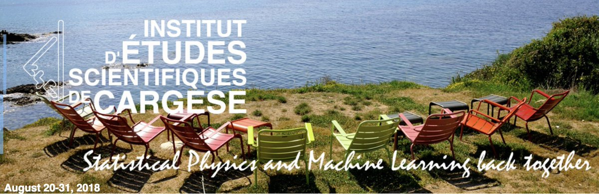

# Program, day by day

Andrea Montanari: 

# Poster sessions

# Twitter feed:

<a href="https://twitter.com/intent/tweet?button_hashtag=cargese2018&ref_src=twsrc%5Etfw" class="twitter-hashtag-button" data-show-count="false">Tweet #cargese2018</a>

More information on [the institute webpage](http://www.iesc.univ-corse.fr/index.php?id=1&L=1)

